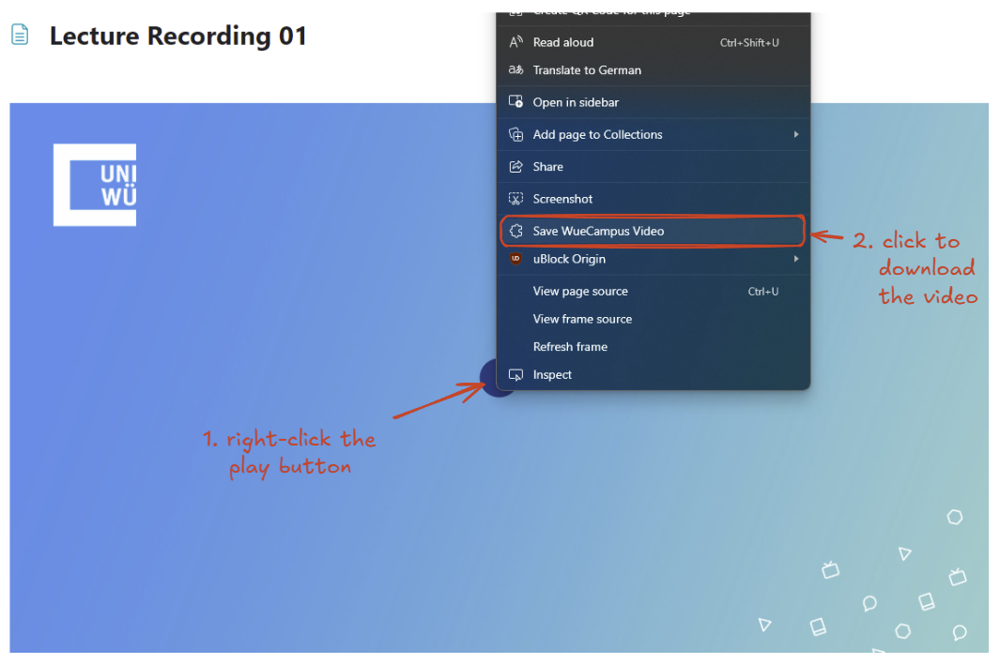

# Description

Browser extension that allows the user to download videos from WueCampus without having to inspect the page and search for the link.

Tested with Chrome and Edge

# How to Use

1. Find the video you want to download.
2. Right-click the play button of a video and select `Save WueCampus Video`
3. Choose a location to save the file

# How to Install (Developer Mode)

1. Clone this repository
2. In your browser, go to `Extensions` > `Manage Extensions`
3. Enable `Developer mode`
4. Select `Load unpacked`
5. Select the `browser-extension` folder from this repository

_You can currently only install this extension in developer mode, as I don't want to publish it to the chrome web store._ 
